# AgentPayment Sandbox (APS)

> **Postman + Chaos Monkey + Case Manager for Agent Payments**

A testing and development platform for AI agent payment protocols. Test your payment integrations locally before deploying to production.

[](LICENSE)
[](https://python.org)
[](https://typescriptlang.org)
[](#supported-protocols)

---

## 🚀 [Launch Live Demo](https://siva-sub.github.io/AgentPayment-Sandbox/)

---

## 🌊 The Paradigm Shift: Agents Can Now Shop

We are witnessing a fundamental shift in how commerce happens on the internet.

```
┌─────────────────────────────────────────────────────────────────────────────┐
│                        THE OLD WORLD (Human Commerce)                        │
├─────────────────────────────────────────────────────────────────────────────┤
│                                                                              │
│    Human → Browser → Click "Buy" → Enter Card → CAPTCHA → Confirm → Done    │
│                                                                              │
│    • Designed for eyeballs and fingers                                       │
│    • CAPTCHAs actively block automation                                      │
│    • Payment forms require human interaction                                 │
│    • No standard API for "agent wants to buy this"                          │
│                                                                              │
└─────────────────────────────────────────────────────────────────────────────┘

                                    ↓ PARADIGM SHIFT ↓

┌─────────────────────────────────────────────────────────────────────────────┐
│                      THE NEW WORLD (Agentic Commerce)                        │
├─────────────────────────────────────────────────────────────────────────────┤
│                                                                              │
│    Agent → API Discovery → Structured Checkout → Cryptographic Auth → Done  │
│                                                                              │
│    • Designed for autonomous software agents                                 │
│    • Machine-readable protocols (JSON-RPC, REST)                            │
│    • Cryptographic signatures replace passwords                              │
│    • Mandates and limits replace CAPTCHAs                                   │
│                                                                              │
└─────────────────────────────────────────────────────────────────────────────┘
```

**The question is no longer IF agents will transact, but HOW.**

Four major protocols have emerged:
- **AP2** (Google) - Agent-to-Agent mandates with cryptographic authorization
- **x402** (Coinbase) - HTTP 402 "Payment Required" for micropayments
- **ACP** (Shopify) - OpenAPI-based checkout for complex purchases
- **UCP** (Stripe) - Universal commerce protocol for seamless checkout

Each solves a piece of the puzzle. **APS helps you test all of them.**

---

## 💡 Why I Built This

Fascinated by the intersection of **AI agents** and **financial infrastructure**, I saw a critical gap emerging:

> **"How do developers test agent payment flows without spending real money or building mock servers from scratch?"**

When building AI agents that shop, pay, and transact, you face these challenges:

| Challenge | Traditional Solution | APS Solution |
|-----------|---------------------|--------------|
| Testing payments | Use real money or test accounts | Mock servers, free and instant |
| Protocol compliance | Read specs, hope you got it right | Inspector validates automatically |
| Multiple protocols | Learn and implement each one | Unified testing for all 4 |
| Security validation | Manual code review | Automated signature verification |
| Edge cases | Hard to reproduce | Controllable mock responses |

APS is the **"Postman for agent commerce"** - a sandbox where you can:
- ✅ Test your agent's shopping flow without real purchases
- ✅ Validate protocol compliance before production
- ✅ Debug payment signatures with security analysis
- ✅ Learn protocols interactively through the Playground UI

---

## What is APS?

APS is a **sandbox testing tool** for AI agent commerce protocols. It provides:

| Component | Purpose |
|-----------|---------|
| **Mock Servers** | Simulate merchant/payment backends without real infrastructure |
| **Playground UI** | Interactive protocol explorer with live request/response |
| **Inspector** | Validate external implementations against protocol specs |
| **Security Analyzer** | Signature verification and security scoring |

---

## 📖 Key Scenarios

### 1. Agent Shopping Flow (UCP/ACP)

```mermaid
sequenceDiagram
    participant Agent
    participant APS Mock
    Agent->>APS Mock: GET /.well-known/ucp
    APS Mock-->>Agent: Discovery Profile
    Agent->>APS Mock: POST /checkout-sessions
    APS Mock-->>Agent: Session Created
    Agent->>APS Mock: POST /complete
    APS Mock-->>Agent: ✅ Order Confirmed
```



### 2. Micropayments (x402)


### 3. Multi-Agent Purchase (AP2)

```mermaid
sequenceDiagram
    participant User
    participant Shopping Agent
    participant APS Mock
    User->>Shopping Agent: "Buy laptop"
    Shopping Agent->>APS Mock: ap2/browseProducts
    APS Mock-->>Shopping Agent: Products
    Shopping Agent->>APS Mock: ap2/createCart
    APS Mock-->>Shopping Agent: CartMandate
    User->>Shopping Agent: Approve + OTP
    Shopping Agent->>APS Mock: ap2/submitOtp
    APS Mock-->>Shopping Agent: ✅ Receipt
```



---

## Supported Protocols

| Protocol | Maintainer | Mock Server | Inspector | Tests |
|----------|------------|-------------|-----------|-------|
| [AP2](https://github.com/google-agentic-commerce/AP2) | Google | ✅ `/mock/ap2` | ✅ | 2 |
| [x402](https://github.com/coinbase/x402) | Coinbase | ✅ `/mock/x402` (v2) | ✅ | 5 |
| [ACP](https://github.com/ShopifyAPI/agentic-commerce-protocol) | Shopify | ✅ `/mock/acp` | ✅ | 5 |
| [UCP](https://github.com/AiCommerce-Labs/universal-commerce-protocol) | Stripe | ✅ `/mock/ucp` | ✅ | 5 |

---

## 🏗 Architecture


### Tech Stack

| Layer | Technologies |
|-------|-------------|
| **Frontend** | React, TypeScript, Vite, TailwindCSS |
| **Backend** | Python 3.11+, FastAPI, Pydantic |
| **Validation** | JSON Schema, Pydantic validators |
| **Protocols** | x402 v2, ACP OpenAPI, AP2 A2A |

---

## 🛠 Local Development

### Prerequisites
- Python 3.11+
- Node.js 18+
- uv (recommended) or pip

### 1. Backend

```bash
cd backend
uv sync  # or: pip install -e .
uvicorn app.main:app --port 8080
```

### 2. Frontend

```bash
cd frontend
npm install
npm run dev
```

### 3. Test Endpoints

```bash
# UCP Discovery
curl http://localhost:8080/mock/ucp/.well-known/ucp

# x402 PaymentRequired
curl http://localhost:8080/mock/x402/resource/premium-content

# Security Analysis
curl -X POST http://localhost:8080/api/security/analyze/x402 \
  -H "Content-Type: application/json" \
  -d '{"payload": {...}, "requirements": {...}}'
```

---

## 📚 Documentation

- **[API Reference](docs/API_REFERENCE.md)** - Complete endpoint documentation
- **[Usage Guide](docs/USAGE.md)** - Testing scenarios and integration examples
- **[Flow Diagrams](docs/FLOWS.md)** - Protocol sequence diagrams
- **[State Machine](docs/STATE_MACHINE.md)** - Session and payment states
- **[Architecture](docs/ARCHITECTURE.md)** - System design deep dive

### Architecture Decision Records (ADRs)

- [ADR-001: Protocol Alignment](docs/adr/001-protocol-alignment.md)
- [ADR-002: Mock Server Design](docs/adr/002-mock-server-design.md)
- [ADR-003: x402 v2 Adoption](docs/adr/003-x402-v2-adoption.md)

---

## Disclaimer

This is a **portfolio project/prototype**. It is designed for testing and development purposes. The mock servers simulate protocol behavior but do not perform real payment processing or cryptographic verification.

---

## 👤 About the Author

**Sivasubramanian Ramanathan**
*Product Owner | Fintech, Payments & Digital Innovation*
*Ex-BIS Innovation Hub Singapore*

I specialize in taking complex, real-world problems and structuring them into reliable products. My background spans product delivery, user research, and cross-agency collaboration.

**Open for roles in Product Management, Fintech, Payments, RegTech, and Digital Assets.**

[](https://www.linkedin.com/in/sivasub987)
[](https://www.sivasub.com)
[](https://github.com/siva-sub)

---

## About

AgentPayment Sandbox (APS) - Testing platform for AI agent payment protocols (AP2, x402, ACP, UCP).

Built with ❤️ for the agentic commerce ecosystem.

[siva-sub.github.io/AgentPayment-Sandbox/](https://siva-sub.github.io/AgentPayment-Sandbox/)
