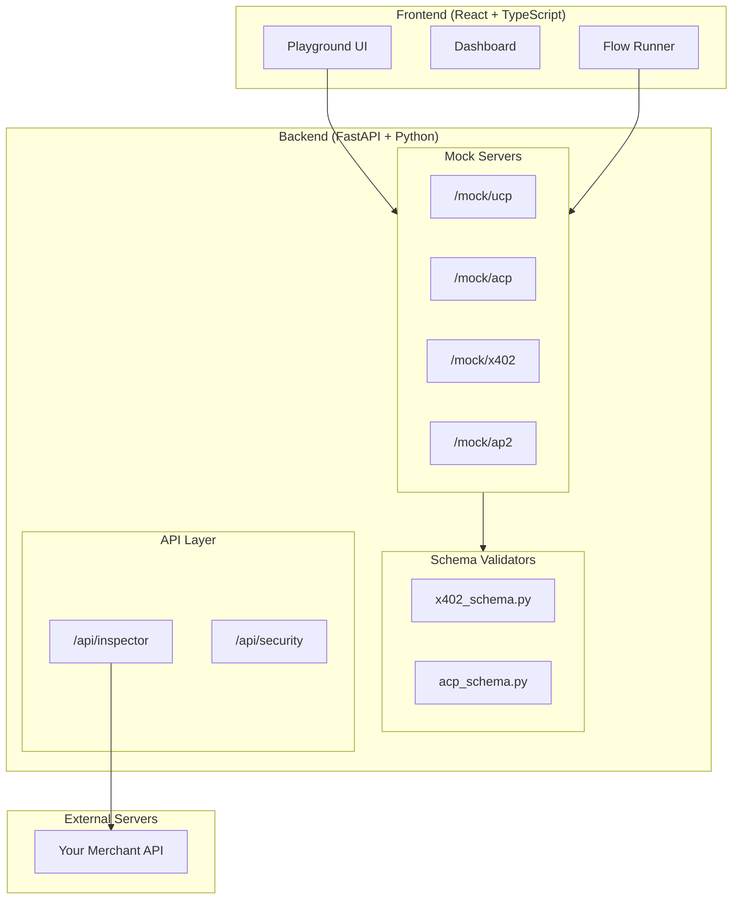
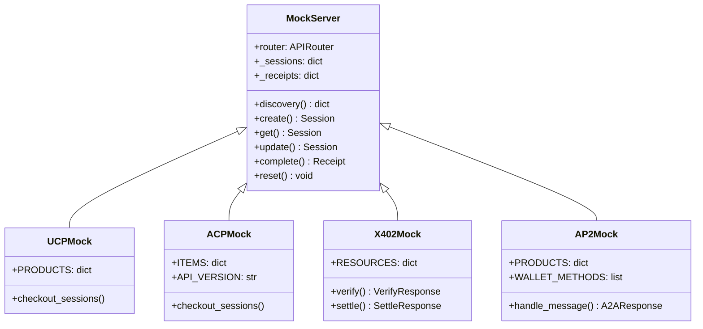
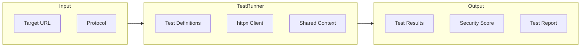
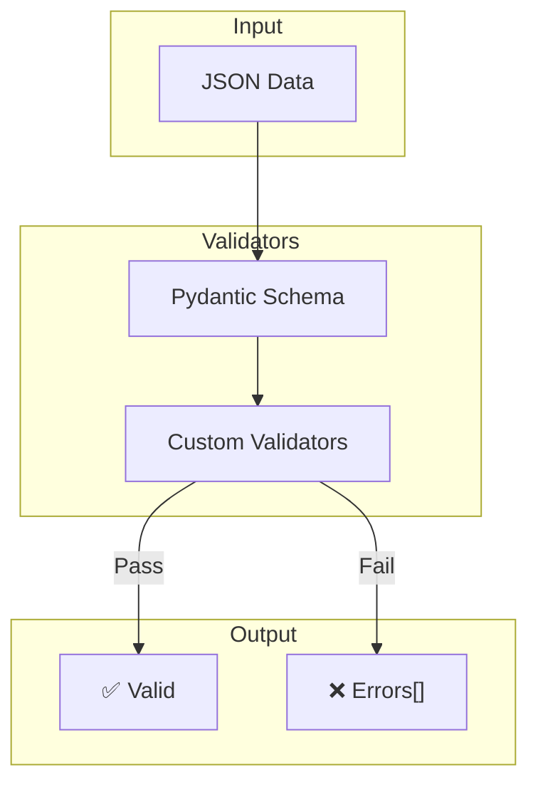
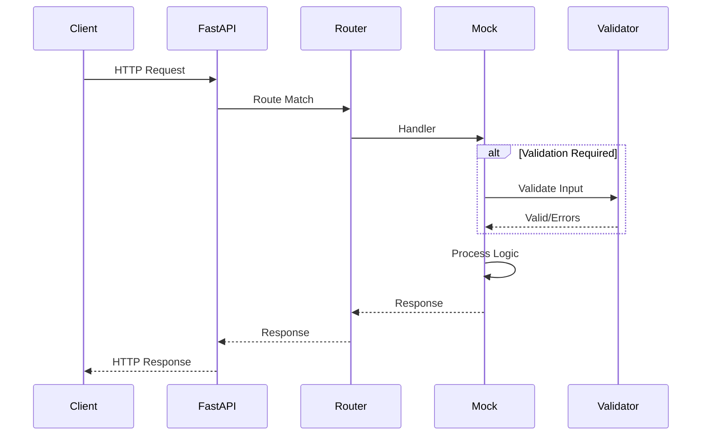
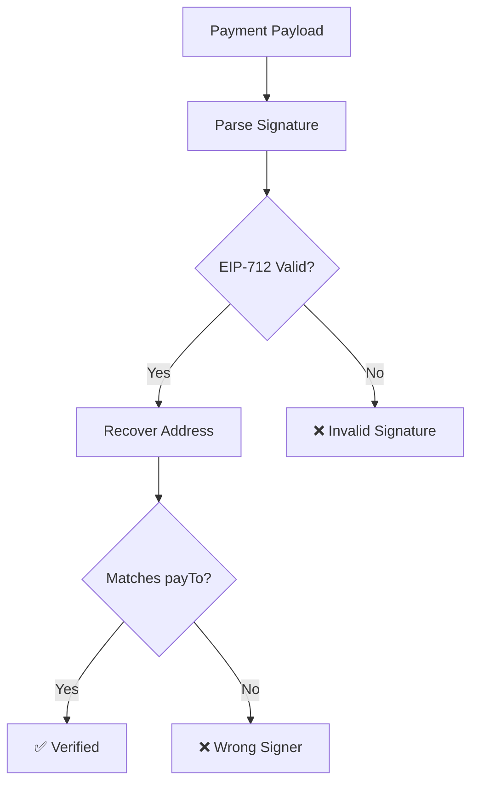

# APS Architecture

Deep dive into the AgentPayment Sandbox architecture.

---

## System Overview



---

## Component Details

### Mock Server Architecture

Each mock server follows a consistent pattern:

```
/mock/{protocol}/
├── .well-known/{discovery}  # Discovery endpoint
├── {resource}               # CRUD operations
├── test/reset               # Reset state
└── test/generate-*          # Test helpers
```



---

### Inspector Architecture



### Test Execution Flow

1. Load test definitions for protocol
2. Execute tests in order (respecting dependencies)
3. Accumulate context (session IDs, etc.)
4. Calculate security score based on weights
5. Generate comprehensive report

---

### Validator Architecture



---

## Data Flow

### Request Processing



---

## Security Layer

### Signature Verification (Phase 6)



### Security Scoring Algorithm

```python
score = 0
for test in tests:
    if test.passed:
        score += test.weight
    else:
        score -= test.weight * 0.5  # Penalty

security_score = normalize(score, 0, 100)
```

---

## Deployment Architecture

### Local Development

```
┌─────────────────────────────────────┐
│            Developer Machine         │
├─────────────────────────────────────┤
│  Frontend: http://localhost:5173    │
│  Backend:  http://localhost:8080    │
└─────────────────────────────────────┘
```

### GitHub Pages (Demo)

```
┌─────────────────────────────────────┐
│          GitHub Pages               │
│  siva-sub.github.io/APS             │
├─────────────────────────────────────┤
│  Static React Build                 │
│  Mock Data (localStorage)           │
└─────────────────────────────────────┘
```
