# APS Protocol Flows

This document describes the message flows for each supported protocol.

---

## UCP (Universal Commerce Protocol)

---

## ACP (Agentic Commerce Protocol)

---

## x402 (HTTP 402 Payment Required)

---

## AP2 (Agent Payments Protocol)

### Human-Present Purchase Flow

```mermaid
sequenceDiagram
    participant User
    participant Shopping Agent
    participant Merchant Agent
    participant Credentials Provider
    participant Payment Processor

    User->>Shopping Agent: "Buy a laptop"

    Shopping Agent->>Merchant Agent: ap2/browseProducts
    Merchant Agent-->>Shopping Agent: Products List

    Shopping Agent->>User: Show options
    User->>Shopping Agent: Select laptop_pro

    Shopping Agent->>Merchant Agent: ap2/createCart
    Note over Merchant Agent: Merchant signs CartMandate
    Merchant Agent-->>Shopping Agent: CartMandate

    Shopping Agent->>User: Approve purchase?
    Note over User: Signs CartMandate

    Shopping Agent->>Credentials Provider: ap2/listPaymentMethods
    Credentials Provider-->>Shopping Agent: Cards, USDC Wallet

    User->>Shopping Agent: Use Visa ****4242
    Shopping Agent->>Credentials Provider: ap2/selectPaymentMethod
    Credentials Provider-->>Shopping Agent: selection_id

    Shopping Agent->>Payment Processor: ap2/initiatePayment
    Payment Processor-->>Shopping Agent: OTP Required

    User->>Shopping Agent: Enter OTP: 123456
    Shopping Agent->>Payment Processor: ap2/submitOtp
    Payment Processor-->>Shopping Agent: PaymentReceipt

    Shopping Agent->>User: Purchase Complete! 🎉
```

---

## Security Considerations

### Signature Verification Flow

