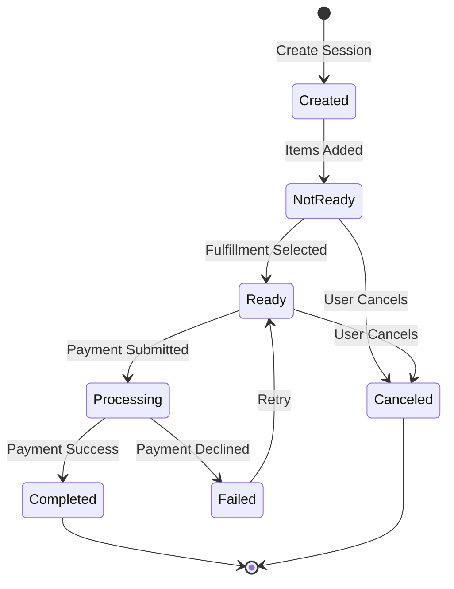
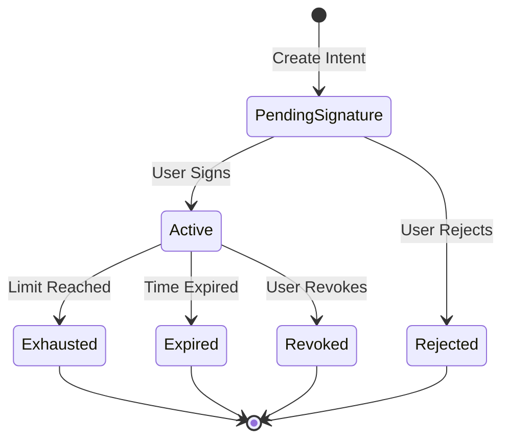
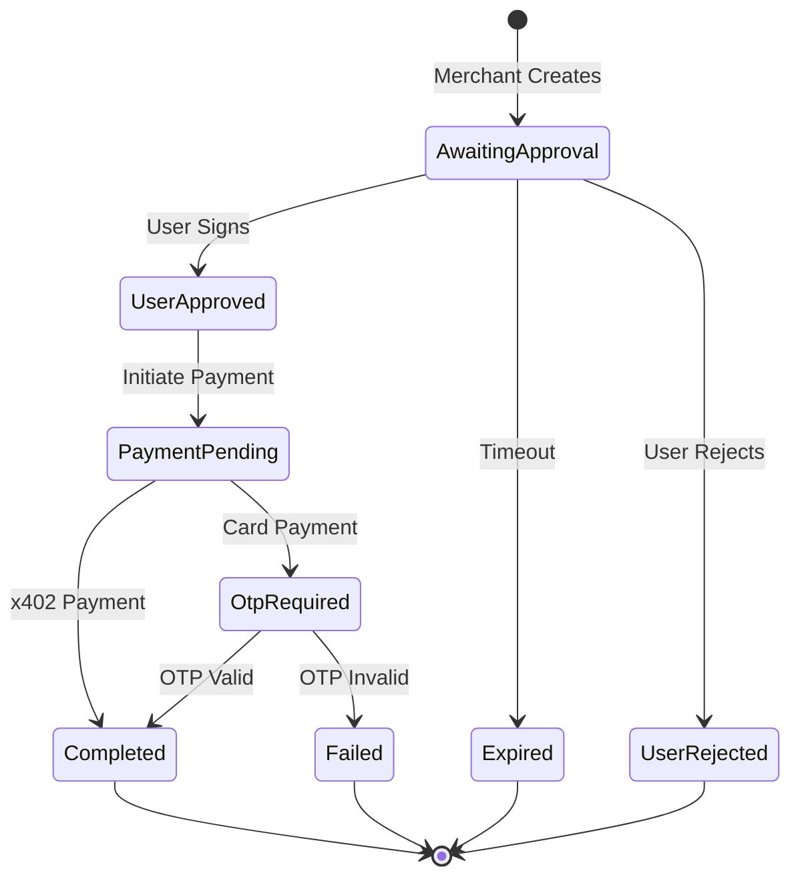
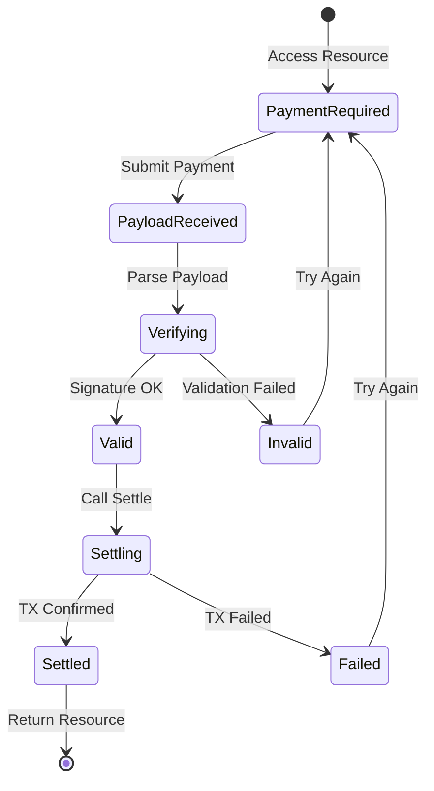
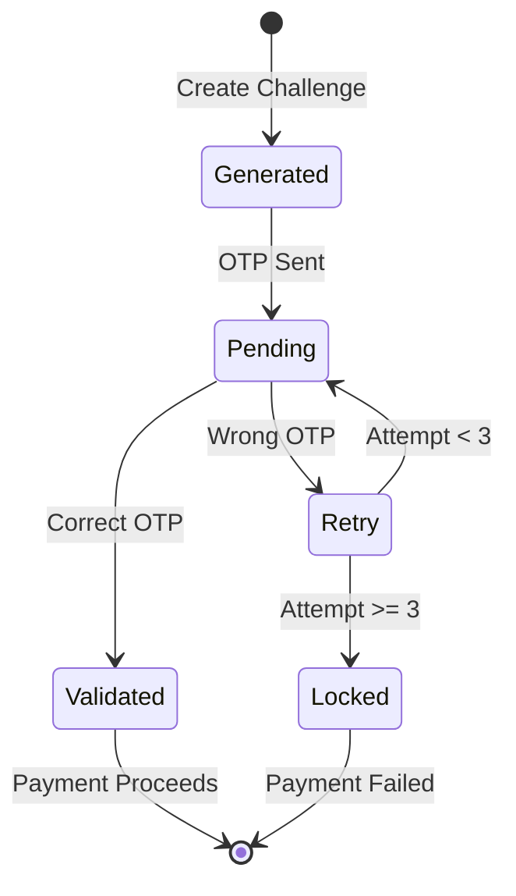

# APS State Machines

This document describes the state machines for sessions and payments across protocols.

---

## Checkout Session States

All protocols follow a similar session lifecycle:

### UCP Session States

| State | Description | Allowed Actions |
|-------|-------------|-----------------|
| `created` | Session initialized | Update, Cancel |
| `ready` | Ready for payment | Complete, Cancel |
| `completed` | Payment captured | None |
| `cancelled` | Session cancelled | None |

### ACP Session States

| State | Description | Transition Condition |
|-------|-------------|---------------------|
| `not_ready_for_payment` | Missing fulfillment | Add address + select option |
| `ready_for_payment` | Can submit payment | Fulfillment complete |
| `completed` | Order placed | Payment success |
| `canceled` | Session cancelled | User or timeout |

---

## AP2 Mandate States

### IntentMandate Lifecycle

### CartMandate Lifecycle

---

## x402 Payment States

### Verification Checks

| Check | Error Code | Description |
|-------|------------|-------------|
| Version | `invalid_x402_version` | Must be 2 |
| Signature | `invalid_exact_evm_payload_signature` | EIP-712 invalid |
| Amount | `invalid_exact_evm_payload_authorization_value` | Insufficient |
| Recipient | `invalid_exact_evm_payload_recipient_mismatch` | Wrong payTo |
| Time Window | `invalid_exact_evm_payload_authorization_valid_*` | Time expired |
| Nonce | `nonce_already_used` | Replay attack |

---

## OTP Challenge States

| State | Max Attempts | Timeout |
|-------|--------------|---------|
| `pending` | 3 | 5 minutes |
| `validated` | - | - |
| `locked` | - | 30 minutes |
